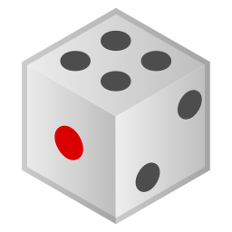

<p align='center'></p>
 <h1 align='center'>Dice</h1>

<p align="center">Lookup dice-generated passphrases from EFF's long wordlist.</p>

<br /><br />

[Dice-generated passphrases][dice] are nice, but looking them up from the [wordlist][deep-wordlist] can be a bit tedious.

This tiny command-line tool contains a copy of [Electronic Frontier Foundation's Long Wordlist][wordlist] and does the lookup for you without your data leaving your computer at any time. Get your dice rolling!

  [dice]: https://www.eff.org/dice
  [deep-wordlist]: https://www.eff.org/deeplinks/2016/07/new-wordlists-random-passphrases
  [wordlist]: https://www.eff.org/files/2016/07/18/eff_large_wordlist.txt

Usage
-----

1. Roll five dice at once, as many times as you wish (typically: six times) and write down the results as described in this [Electronic Frontier Foundation's guide][dice].
1. Run `dice` in you preferred terminal
1. Input the result of the throws of your dice when prompted
1. Copy your **passphrase**!

```bash
# Or just run dice and follow the instructions!
dice
```

Installation
------------

[](https://travis-ci.org/gonzalo-bulnes/dice)

_To be defined._

Contributing
------------

[](http://makeapullrequest.com)

Whether it is your first pull request or your 100th, the [contributing guidelines][contributing] are here to help you get started!

Please note that by participating in this project, you agree to abide by its [code of conduct]. That is true for pull requests, and also when participating in issues.

  [contributing]: ./CONTRIBUTING.md
  [code of conduct]: ./CODE_OF_CONDUCT.md

Credits
-------

The game die emoji in the header was rendered from an SVG that belongs to Google and [was published under the Apache License v2.0 as part of Noto Emoji](https://github.com/googlei18n/noto-emoji).

License
-------

    Dice
    Copyright (C) 2018 Gonzalo Bulnes Guilpain

    This program is free software: you can redistribute it and/or modify
    it under the terms of the GNU General Public License as published by
    the Free Software Foundation, either version 3 of the License, or
    (at your option) any later version.

    This program is distributed in the hope that it will be useful,
    but WITHOUT ANY WARRANTY; without even the implied warranty of
    MERCHANTABILITY or FITNESS FOR A PARTICULAR PURPOSE.  See the
    GNU General Public License for more details.

    You should have received a copy of the GNU General Public License
    along with this program.  If not, see <http://www.gnu.org/licenses/>.
